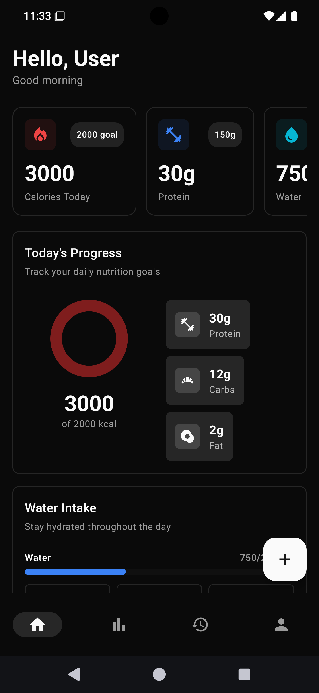
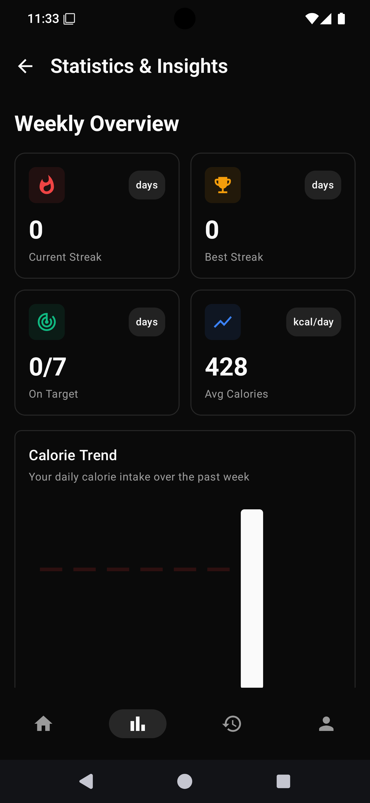
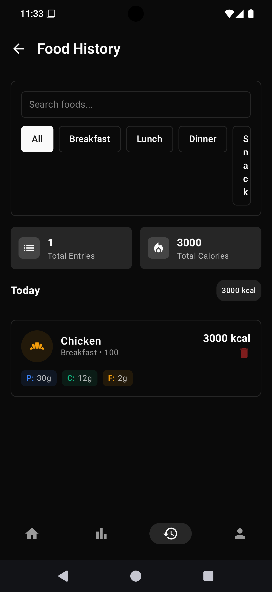
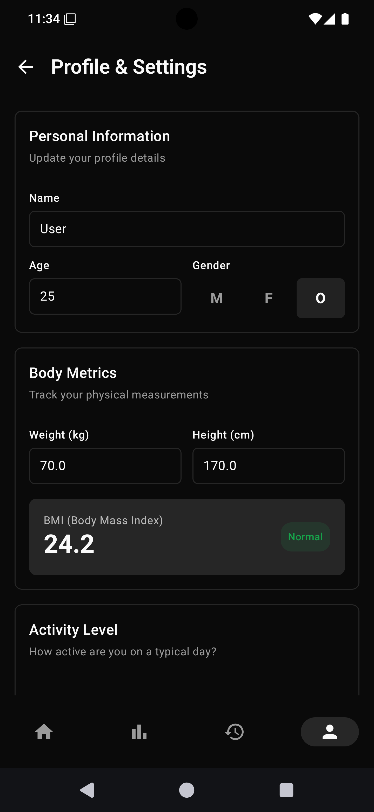

# CaLio

A professional Android calorie tracking application built with Clean Architecture and Jetpack Compose.

## Features

- Daily calorie and macronutrient tracking (protein, carbs, fat)
- Water intake monitoring
- Weekly statistics with custom charts
- Streak tracking and progress insights
- BMI and TDEE calculator
- User profile and customizable daily targets
- Material Design 3 UI with neutral theme
- Local data persistence

## Screenshots

<p align="center">
  
  
  
  
</p>

## Architecture

### Clean Architecture Layers

**Domain Layer**
- Entities: FoodEntry, UserSettings, DailyStats, WeeklyProgress
- Repository interfaces
- Use cases for all business operations

**Data Layer**
- Repository implementation with SharedPreferences
- Local data persistence

**Presentation Layer**
- MVVM pattern with ViewModel
- Jetpack Compose UI
- StateFlow for reactive state management

## Tech Stack

- Kotlin
- Jetpack Compose
- Material Design 3
- MVVM Architecture
- Clean Architecture
- StateFlow
- SharedPreferences
- No external dependencies for core functionality

## Project Structure

```
app/src/main/java/app/calio/android/
├── domain/
│   ├── entity/
│   ├── repository/
│   └── usecase/
├── data/
│   └── repository/
├── viewmodel/
└── ui/
    ├── components/
    ├── screens/
    └── theme/
```

## Getting Started

1. Clone the repository
2. Open in Android Studio
3. Sync Gradle
4. Run on emulator or device (Min SDK: 24)

## Privacy

All data is stored locally on your device. No data is transmitted to external servers. See [PRIVACY.md](PRIVACY.md) for details.

## License

MIT License
